# Objective
1. Create VM on any cloud provider
2. Install NGINX
3. Host "Hello World" website
4. Add a local ANAME record to access the website

# Implementation

## VM creation
Create a VM on azure. Login to the azure account and create a new resource. Here it is assumed that the user already has some kind of subscripiton.

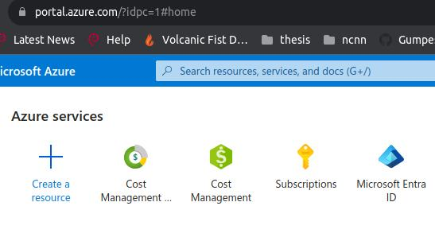

Create a virtual machine

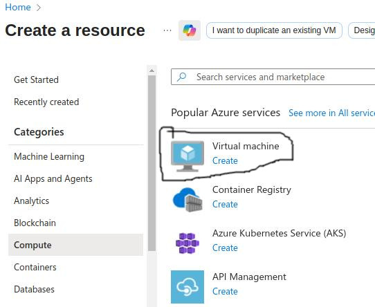

Configure the VM. Create a new or select an existing resource group.

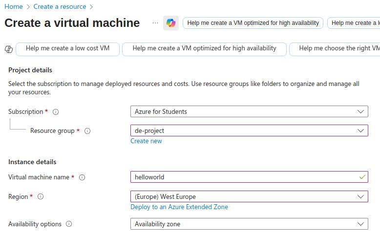

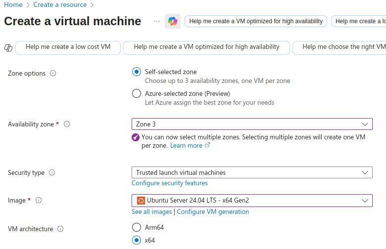

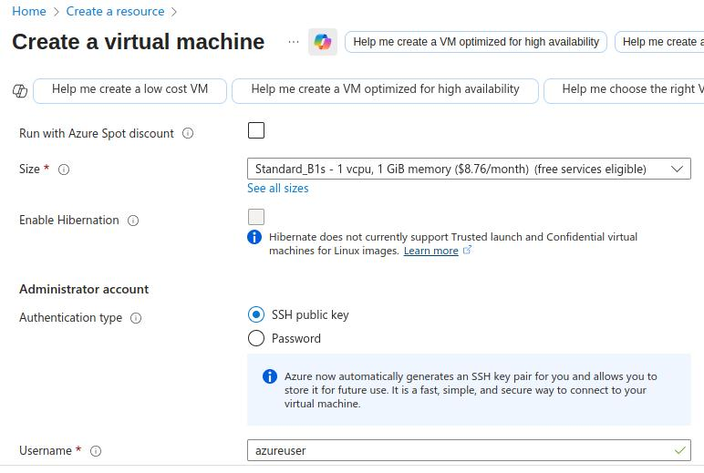

Open ports 22 for SSH, 80 for HTTP and 443 for HTTPS. Firewall rules can also be changed after VM has been created.

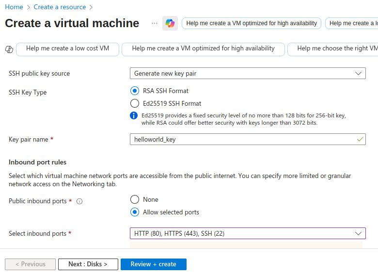

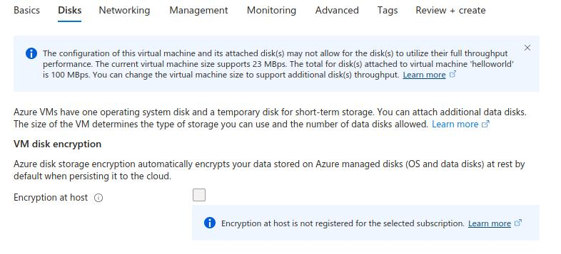

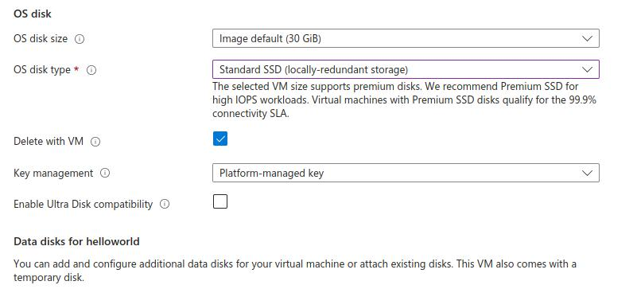

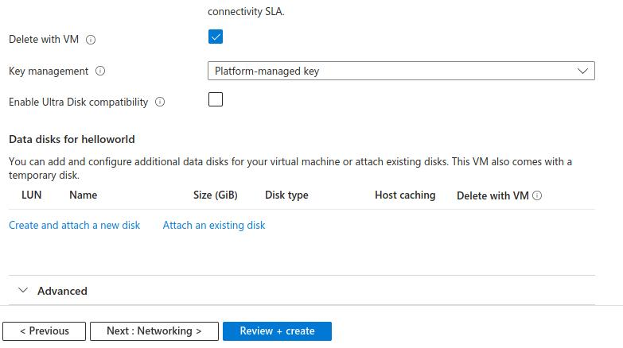

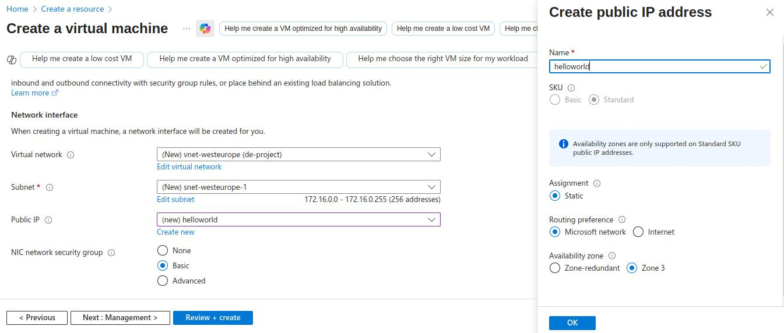

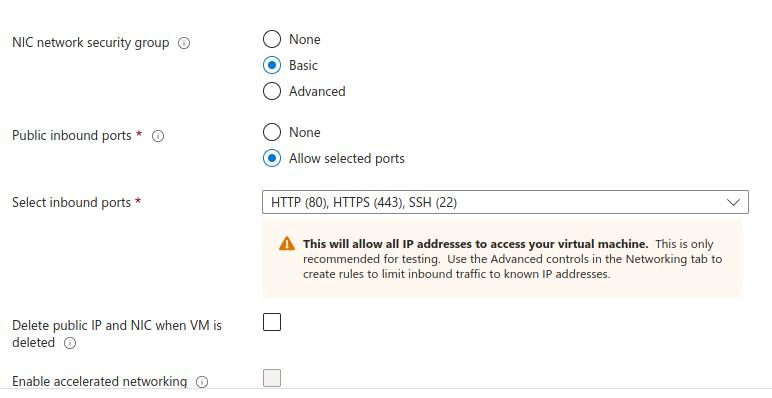

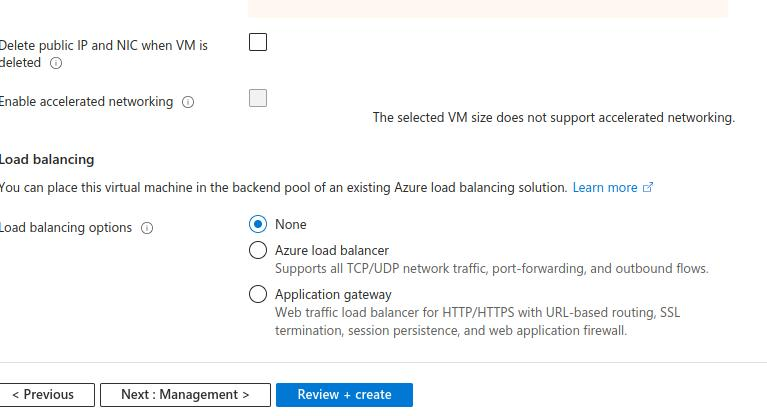

Download the identity key. It will be used to remotely login to the VM

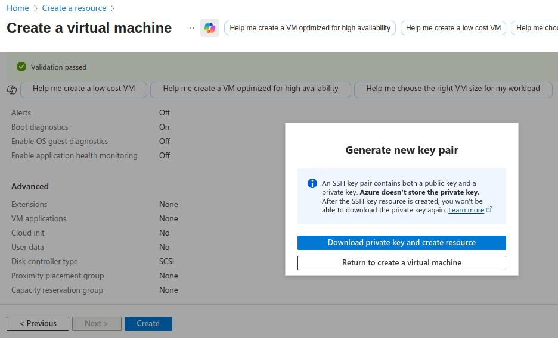

### Accessing VM
The VM will be accessed using the key file downloaded on the creation of the VM and its public IP address. Change the permission of the vm identity key to read only for the user:

```
# By default, group and others also have read access. When trying to access the VM using the key file with default permission, this warning was generated:
# Permissions 0644 for 'helloworld_key.pem' are too open.

# Update file permissions
chmod 400 helloworld_key.pem
# Login to the VM
ssh -i helloworld_key.pem azureuser@<PUBLIC_IP_ADDRESS>
```

### Install docker
Install docker by following the instructions from [here](https://docs.docker.com/engine/install/ubuntu/)

### Install NGINX
Download nginx docker container
```
docker pull nginx:1.29.0-bookworm
```

## Host the website
Copy the website files from the host to the VM
```
# Using SCP
scp -i helloworld_key.pem -r html azureuser@<PUBLIC_IP_ADDRESS>:/home/azureuser/

# Using rsync
rsync -avz -e "ssh -i /home/tahir/coding/shakel_devops/project2/helloworld_key.pem" /home/tahir/coding/shakel_devops/project2/html azureuser@<PUBLIC_IP_ADDRESS>:/home/azureuser/
```

The default configuration uses `.conf` for additonal configuration. And in this case, just the `/etc/nginx/html` directory was updated with cutstom `index.html` file. To use a customized configuration file mount the `.conf` file to `/etc/nginx/conf.d/website_name.conf` and the website files to whatever the path has been mentioned in the configuration file. HTTP port is open for the VM so the website is just forwarded to it.

```
docker run -d -p 80:80 -v ./html:/usr/share/nginx/html nginx:1.29.0-bookworm

# Test the website is working
curl localhost:80
```
### Access the website from host system
Access the webiste using the public ip address of the VM
```
# Access from a web browser
http://<PUBLIC_IP_ADDRESS>/

# Using curl
curl http://<PUBLIC_IP_ADDRESS>/
```

## Add a local DNS record
Add the desired DNS record on the host.
```
echo -e "<PUBLIC_IP_ADDRESS>\thello-vm.com" | sudo tee /etc/hosts
# Test the website
curl hello-vm.com
```

## Cleanup
Stop and remove nginx container
```
# Assuming there is only 1 nginx container
docker stop $(docker ps -aq  --filter ancestor=nginx:1.29.0-bookworm)
docker rm $(docker ps -aq  --filter ancestor=nginx:1.29.0-bookworm)
```