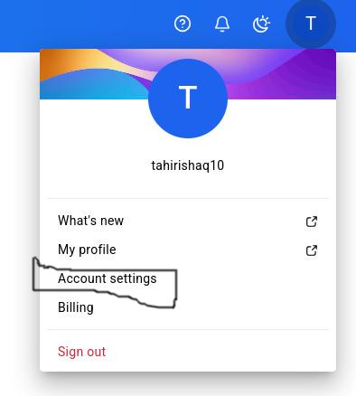
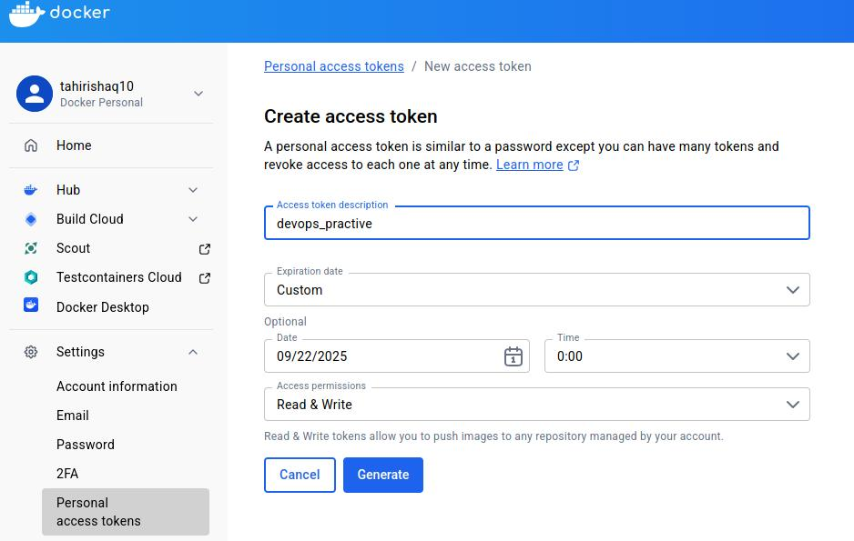
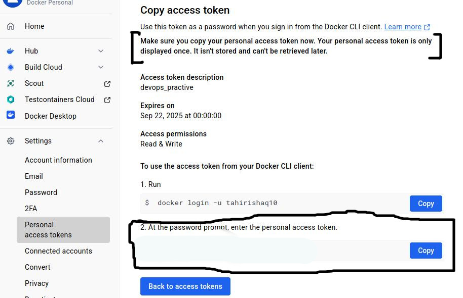

# Objective
1. Contanize the website
2. Push the image to dockerhub or any ther registry
3. Create a VM on any public cloud
4. Install docker on the VM
5. Host the website by using the website image

# Implementation

## Containerize website
The instructions to containerize using docker can found [here](https://docs.docker.com/get-started/docker-concepts/building-images/build-tag-and-publish-an-image/)

```
docker build -t tahirishaq10/hello:v1 -f Dockerfile .
```

Test locally
```
docker run -d -p 8080:80 hello:v1
curl localhost:8080
```

Login to dockerhub.



Create new access token



Use the access token to login to dockerhub



Push the image to docker hub
```
docker push tahirishaq10/hello:v1
```

## Create a VM
To create a VM on azure, follow the step from [project2](../project-2/README.md).

## Host the website
```
docker run -d -p 80:80 tahirishaq10/hello:v1

# Test the website from within the VM
curl localhost:80
```

## Access the website from host system
Access the webiste using the public ip address of the VM
```
# Access from a web browser
http://<PUBLIC_IP_ADDRESS>

# Using curl
curl http://<PUBLIC_IP_ADDRESS>
```

## Add a local DNS record
Add the desired DNS record on the host.
```
echo -e "<PUBLIC_IP_ADDRESS>\thello-vm.com" | sudo tee /etc/hosts
# Test the website
curl hello-vm.com
```

## Cleanup
Stop and remove nginx container
```
# Assuming there is only 1 nginx container
docker stop $(docker ps -aq  --filter ancestor=nginx:1.29.0-bookworm)
docker rm $(docker ps -aq  --filter ancestor=nginx:1.29.0-bookworm)
```
