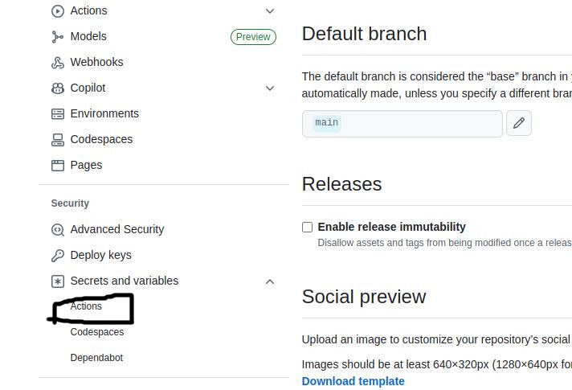

# Objective
Create 2 github actions workflow:
1. workflow 1 containarizes the website and uploads it to container registry.
2. Workflow 2 connects to the VM, pulls the website image from the registry and hosts the website.

# Implementation
## Github actions
A github application that performs a set of actions in a virtual environment in response to the defined [changes](https://docs.github.com/en/actions/reference/workflows-and-actions/events-that-trigger-workflows) in the repository. The responses are defined in `.yaml` file and are called `workflow`.

### Github workflow
Github actions configurations file written in `.yml`. A workflow can have multiple sections and sections execution can also be conditional on other sections. A existing template can be used and customized or a completely new one can be created.

#### Actions
Libraries/plugins used in workflow defined in `action.yml`. Most common purpose ones e.g. [git checkout](https://github.com/actions/checkout) are provided by [github](https://github.com/actions). Third party actions like [docker build and push](https://github.com/docker/build-push-action) and [ssh](https://github.com/appleboy/ssh-action) are are also available.

Each github repository needs to configured to be be able to use github actions.

### Sample Workflow
To get started, select a the tempelate `Manual Workflow`.

This workflow uses [workflow_dispatch](https://docs.github.com/en/actions/reference/workflows-and-actions/events-that-trigger-workflows#workflow_dispatch) as the trigger condition which allows the workflow to only be triggered [manually](https://docs.github.com/en/actions/how-tos/manage-workflow-runs/manually-run-a-workflow) and prints `Hello World` on the console.

### Customized Workflow
The workflow is able to use secrets and variables. They can be created for the whole repository or only for certain github workflows.

Create a secret variable for github actions

For this project we need the following secrets:

| Name | Description |
| --- | --- |
| DOCKERHUB_TOKEN | Dockerhub token |
| DOCKER_USERNAME | Dockerhub username |
| VM_IP | Cloud VM public IP address  |
| VM_USER | VM username |
| VM_PEM | VM key |

Azure uses a `.pem` key file to login to its VM. Copy the contents of the azure VM key e.g. `helloworld_key.pem` to a secret variable.

The following actions will be used in this workflow:

| Action | Description |
| --- | --- |
| [Docker Build Push](https://github.com/docker/build-push-action) | To build and push docker images |
| [SSH](https://github.com/appleboy/ssh-action) | Executing remote SSH commands |

